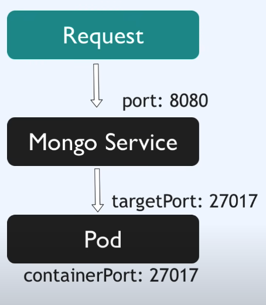

# Containerize
#### Learning
1. port:port?
docker run -p [HOST_PORT]:[CONTAINER_PORT] [IMAGE]
Ref: 
- https://medium.com/@AbbasPlusPlus/docker-port-mapping-explained-c453dfb0ae39
  - After setting up port forwarding, any request sent to port 3000 on the host machine is automatically forwarded to port 3000 in the container.
  - Best Practices for Port Forwarding
    1. Choose Non-Standard Host Ports: Avoid using common ports on the host to reduce security risks and conflicts.
    2. Consistency in Development and Production: Keep port mappings consistent across development and production environments for simplicity.
    3. Document Port Mappings: Maintain clear documentation of which host ports map to which container ports.

Why does postgres need to set different ports?
- 5432 in HOST_PORT has been mapped to postgres in local host.
- So, if we keep using 5432, it will access to postgres in local machine when we use Postico.

2. what does depends_on do?
Doc:
- https://docs.docker.com/compose/compose-file/compose-file-v3/#depends_on
  - docker-compose up starts services in dependency order. In the following example, db and redis are started before web.
  - docker-compose up SERVICE automatically includes SERVICE's dependencies. In the example below, docker-compose up web also creates and starts db and redis.
  - docker-compose stop stops services in dependency order. In the following example, web is stopped before db and redis.

3. How to run & map multiple containers
- Ref:
  - Dockerfile.app & Dockerfile.cron & docker-compose.yml
  - https://docs.docker.com/compose/compose-file/compose-file-v3/#context
    - Either a path to a directory containing a Dockerfile, or a url to a git repository.


4. How to persist data when the container is killed. (Study volumes)
- Doc:
  - https://docs.docker.com/guides/walkthroughs/persist-data/
  - It requires to download the latest docker in your machine.
  - More details: https://docs.docker.com/storage/volumes/

### Scattered note
- if you add the -d flag, it runs the containers in the background, detached from the terminal, and you won't see the container logs in your terminal.

#### Basic command
`$ docker build .`
`% docker image ls`
`% docker build . --tag hero_api:latest`
- https://docs.docker.com/engine/reference/commandline/image_build/
`$ docker ps -a`
- list all container

`$ docker exec -it <container_name> bash`
- access into the container

`% docker logs -ft <container_name>`
- check the log in the docker

`$ docker system prune`
- delete all container

`$ docker rm <container_name>`
- delete a container

#### About PostgreSQL in container
`$ docker run --name postgres-123 -e POSTGRES_PASSWORD=hahow_project -e POSTGRES_USER=postgres -e POSTGRES_DB=hahow_project -p 1311:5432 -d postgres:latest`

`% docker inspect -f '{{range .Config.Env}}{{println .}}{{end}}' <container_name>`
- Check the log in container

`$ docker exec -it postgres-123 psql -U postgres`
- get into container and access to postgres server.

docker push
1. tag the image 
- d tag hero_api-app chunhao1811/hero_api-app
- d push chunhao1811/hero_api-app
- docker tag firstimage YOUR_DOCKERHUB_NAME/firstimage
- docker push YOUR_DOCKERHUB_NAME/firstimage

# About K8S
https://youtu.be/s_o8dwzRlu4?si=3hdd3cUKonh2xAR0&t=2300
brew install minikube

minikube start
minikube status

kubectl depends on minikube
So, brew install minikube, it also downloads kubectl
kubectl get node


https://kubernetes.io/docs/concepts/configuration/configmap/#configmap-object
- db-config.yml

https://kubernetes.io/docs/concepts/configuration/secret/#use-case-dotfiles-in-a-secret-volume
- db-secret.yml


https://kubernetes.io/docs/concepts/workloads/controllers/deployment/#creating-a-deployment
- db.yml

Service
- https://kubernetes.io/docs/concepts/services-networking/service/#service%E3%81%AE%E5%AE%9A%E7%BE%A9

Random
- It is a good practice to set the labels for the pods
  - { app: service_application_name }


  
```
  (base) c.huang@MAC-TW0024 k8s-in-1-hour % kubectl apply -f mongo-secret.yaml 
secret/mongo-secret created
(base) c.huang@MAC-TW0024 k8s-in-1-hour % kubectl apply -f mongo-config.yaml 
configmap/mongo-config created
(base) c.huang@MAC-TW0024 k8s-in-1-hour % kubectl apply -f mongo.yaml       
deployment.apps/mongo-deployment created
service/mongo-service created
```

service -> Pod



minikube cli: start up/delete the cluster
kubectl cli: configure the Minikube cluster
pod is the abstraction of container

In postgres pod
k exec -it pod/postgres-6798dc8575-t5f5n -- /bin/bash
psql -U c.huang -d hahow_project_dev

app-data-source.ts
host should align to service name in postgres.yaml

Open the tunnel for the pod
m service apiapp-service
ref: 
  - https://hackmd.io/6Q-UKmWcQuqx6I5NkIUQlQ?view
  - https://github.com/tall15421542/Learning/tree/main/grpc-experiment?fbclid=IwAR0HOpB2DL0Ew4pBEU99HucPYcxN1x1b1W7KMdaEE-reVIbW8mKC_5JNC5c#how-to-start-the-greeter-client--greeter-server