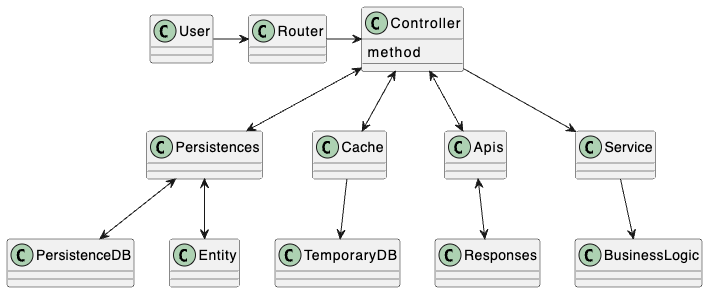

# Installation (我們該如何跑起這個 server)
There are three ways to run this server with and without container
Please clone the code first!
- git clone https://github.com/chuang8511/hero_api.git

## 1. without using container
- `$ npm install`
- Set up your local DB.
  - Download PostgreSQL
  - Set src/app-data-source.ts with your user_name & database.
  - Postgres command
    - `$ psql postgres` in your terminal, you will access to postgres server
    - `postgres=# create database your_database_name;`, it will create a db for you.
    `postgres=# \q`, it will exit postgres server
- start your local Redis server
  - `$ brew install redis`
  - `$ brew services start redis`
- `$ npm run register_user`, it will register the users who can authenticate.
- `$ npm run job`, it runs the cron jobs to fetch data
- `$ npm run serve`, it runs the API server for the users

## 2. Using container
- Please download the latest docker in your machine.
- `$ docker-compose up`
  - It will do three things automatically.
    1. preset username and password for the users
    2. run the cron job
    3. run the server

## 3. Using Cluster
- Please download the latest minikube.
  - `$ brew install minikube`
- Please start your cluster
  - `$ minikube start`
- Please build the pods/ services/ deployments
  - `$ sh k8s/build.sh`
- Please open the apiapp tunnel.
  - `$ minikube service apiapp-service`
- Please check the ip and port that service opens for external


### How to easily test?
- `$ sh src/tests/e2e/dev_e2e_test.sh`, it use curl to fetch API server.

# Structure (專案的架構，API server 的架構邏輯)
## About system design

- Ref: ./visualization_doc/system_design.puml
## About database design

- Ref: ./visualization_doc/data_design.puml
## About layout design

- Ref: ./visualization_doc/directory_structure.puml
### Not Api server
- apis (To call external apis)
  - responses (To format the response from external apis)
- crons (The jobs to fetch data in a period)
- cache (The key-value noSQL to save the CPU resources)
### Api server
- controllers (To define which logic/persistence/service to access.)
- routers (To map endpoint and controller/action)

### data
- entity (ORM to make the data easy to maintain)
- persistences (To process the data logic)
- data (To save data by patch)

### business logic (Or renaming it as domain model)
- services (To process the business logic)

#### Note
1. Why do I separate api response and entity in this case?
We will have more flexibility to de-couple the relationship between API response and data model.
So, I divide them into two different layers, which is persistences layer and APIs layer.


# About test code
#### It will be good to increase the test coverage to some extent.
```
- tests
-- apis
-- crons
-- ...
```
Note
- Because of time limitation, I will only do the test of the controller, which contains more logics in this projects.

# Libraries (你對於所有使用到的第三方 library 的理解，以及他們的功能簡介)
## express
- The framework to build routes and API server.

## typescript
- for static declaration to make the code easier to maintain.
  ### Steps
  1. `$ npx tsc --init` to initialize TypeScript
  2. It will generate tsconfig.json
  3. customize your the tsconfig.json (e.g. rootDir & outDir)

## TypeORM
- for object-relation mapping
- It will be easy to inject and collect data
  ### Steps
  - It needs to set the app-data-source.ts
  ### Doc
  - https://typeorm.io/

## Cron
  ### Why do I need this?
  To speed up client side API, we can save data previously before users fetch API.

  ### How to run the job?
  - `$ npx ts-node src/crons/xxxJob.ts`
  Note: if using `$ node xxx.js`, it will not initialize DB first, which caused a bug when inserting data.

# 你在程式碼中寫註解的原則，遇到什麼狀況會寫註解
- I do not write the command unless there are legacy that the logic are hard to be explained by code.
- Normally, I write the code that can explain the logic.


# 在這份專案中你遇到的困難、問題，以及解決的方法
1. About route
  - I am surprised that authenticated api is GET.
  - I do not know how to differentiate the same route but differet header.
  - But, I have multiple layers to deal with this kind of situation.
  - So, I can deal with this problem in the Route layer.
2. About container
  - The design is not so good in the beginning, so I have to build multiple different containers for my server/job/patch.
  - I use docker-compose to build and map the multiple containers.
  - So, you can easily run the server by container without running the job and patch.